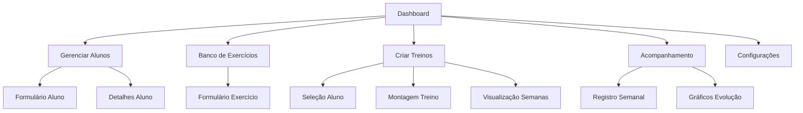

## 1. Visão Geral do Produto

Sistema completo de gerenciamento para personal trainers com foco em organização de alunos, exercícios, treinos e acompanhamento de desempenho. O sistema resolve o problema de gestão manual de fichas de treino e permite acompanhamento detalhado da evolução dos alunos.

Personal trainers poderão cadastrar alunos, criar treinos personalizados, gerenciar um banco de exercícios e registrar o desempenho semanal dos alunos com visualização em gráficos de evolução.

## 2. Funcionalidades Principais

### 2.1 Páginas do Sistema

Nosso sistema de gerenciamento para personal trainers consiste nas seguintes páginas principais:

1. **Dashboard**: Visão geral com cards de resumo, navegação rápida e estatísticas gerais
2. **Gerenciar Alunos**: Lista de alunos, formulário de cadastro/edição, visualização de detalhes
3. **Banco de Exercícios**: Grid de exercícios, formulário de cadastro, filtros por grupo muscular
4. **Criar Treinos**: Interface de montagem de treinos com arrastar-e-soltar, visualização por semanas
5. **Acompanhamento**: Registro semanal de desempenho, gráficos de evolução, comparativos
6. **Configurações**: Perfil do personal, preferências de sistema, modo claro/escuro

### 2.2 Detalhamento das Funcionalidades

| Página | Módulo | Descrição da Funcionalidade |
|--------|---------|-----------------------------|
| Dashboard | Cards de Resumo | Exibir total de alunos ativos, treinos criados, exercícios cadastrados e acompanhamentos da semana |
| Dashboard | Navegação Rápida | Botões de acesso direto para as principais funcionalidades do sistema |
| Dashboard | Estatísticas | Gráfico simples com evolução de novos alunos nos últimos 30 dias |
| Gerenciar Alunos | Lista de Alunos | Tabela com busca, filtros e ações de editar/excluir para cada aluno |
| Gerenciar Alunos | Formulário de Cadastro | Campos para nome (obrigatório), contato e observações médicas com validação em tempo real |
| Gerenciar Alunos | Visualização de Detalhes | Modal com informações completas do aluno e histórico de treinos |
| Banco de Exercícios | Grid de Exercícios | Cards visuais com imagem, nome e grupo muscular de cada exercício |
| Banco de Exercícios | Formulário de Cadastro | Campos para nome, grupo muscular, descrição técnica e upload de imagem |
| Banco de Exercícios | Filtros e Busca | Filtros por grupo muscular e campo de busca por nome do exercício |
| Criar Treinos | Seleção de Aluno | Dropdown com lista de alunos e seleção de período de vigência |
| Criar Treinos | Montagem de Treino | Interface drag-and-drop para selecionar exercícios do banco |
| Criar Treinos | Visualização por Semanas | Divisão automática do treino em semanas conforme período selecionado |
| Criar Treinos | Pré-visualização | Visualização completa do treino antes de salvar com opção de impressão |
| Acompanhamento | Registro Semanal | Interface para registrar pesos e repetições por exercício da semana |
| Acompanhamento | Gráficos de Evolução | Gráficos de linha mostrando progresso por exercício ao longo do tempo |
| Acompanhamento | Comparativo entre Semanas | Tabela comparativa com variações de peso/repetições entre semanas |
| Acompanhamento | Alertas Visuais | Indicadores coloridos para identificar estagnação ou regressão |
| Configurações | Perfil do Personal | Edição de dados pessoais e informações profissionais |
| Configurações | Preferências do Sistema | Configurações de notificações, idioma e formato de data |
| Configurações | Modo Claro/Escuro | Toggle para alternar entre temas com salvamento automático |

## 3. Fluxo de Navegação

### Fluxo Principal do Personal Trainer

O personal trainer acessa o sistema através do dashboard, onde pode visualizar resumos e estatísticas. A partir daí, navega para as diferentes áreas: cadastrar novos alunos, gerenciar o banco de exercícios, criar treinos personalizados ou registrar o desempenho dos alunos.

## 4. Interface do Usuário

### 4.1 Estilo de Design

- **Cores Primárias**: Azul profissional (#2563EB) para elementos principais
- **Cores Secundárias**: Verde sucesso (#10B981), Vermelho erro (#EF4444), Cinza neutro (#6B7280)
- **Estilo de Botões**: Bordas arredondadas com sombra suave, efeito hover sutil
- **Tipografia**: Fonte sans-serif moderna (Inter ou similar), tamanhos: 14px corpo, 16px títulos, 12px textos auxiliares
- **Layout**: Baseado em cards com espaçamento generoso, navegação lateral colapsável
- **Ícones**: Estilo line icons minimalistas, consistentes em todo o sistema

### 4.2 Elementos por Página

| Página | Módulo | Elementos de UI |
|--------|---------|-----------------|
| Dashboard | Cards de Resumo | Cards coloridos com ícones grandes, números em destaque e labels descritivas |
| Dashboard | Navegação Rápida | Botões com ícones e texto, dispostos em grid responsivo |
| Dashboard | Estatísticas | Gráfico de área minimalista com linha suave e pontos de dados |
| Gerenciar Alunos | Lista de Alunos | Tabela com zebra striping, botões de ação com ícones, barra de busca sticky |
| Gerenciar Alunos | Formulário de Cadastro | Inputs com labels flutuantes, validação com ícones de feedback, botão primário destacado |
| Banco de Exercícios | Grid de Exercícios | Cards com imagem 16:9, nome em negrito, tag de grupo muscular colorida |
| Banco de Exercícios | Formulário de Cadastro | Upload de imagem com preview, textarea para descrição, dropdown para grupo muscular |
| Criar Treinos | Montagem de Treino | Dois painéis: esquerdo com exercícios disponíveis, direito com treino sendo montido |
| Criar Treinos | Visualização por Semanas | Abas horizontais para cada semana, lista vertical de exercícios dentro de cada aba |
| Acompanhamento | Registro Semanal | Tabela editável inline, botões de salvar por linha, indicadores de alterações |
| Acompanhamento | Gráficos de Evolução | Gráfico de linha interativo com tooltip detalhado, legenda clara |

### 4.3 Responsividade

- **Desktop-first**: Otimizado para telas grandes (1440px), adaptável para 1024px
- **Mobile-adaptativo**: Menu lateral vira bottom navigation em telas pequenas
- **Touch-friendly**: Botões com área de toque mínima de 44x44px, espaçamento adequado

### 4.4 Considerações de Acessibilidade

- Contraste mínimo de 4.5:1 para texto normal, 3:1 para texto grande
- Navegação completa via teclado com foco visível
- Labels descritivos para todos os formulários
- Feedback visual e textual para todas as ações