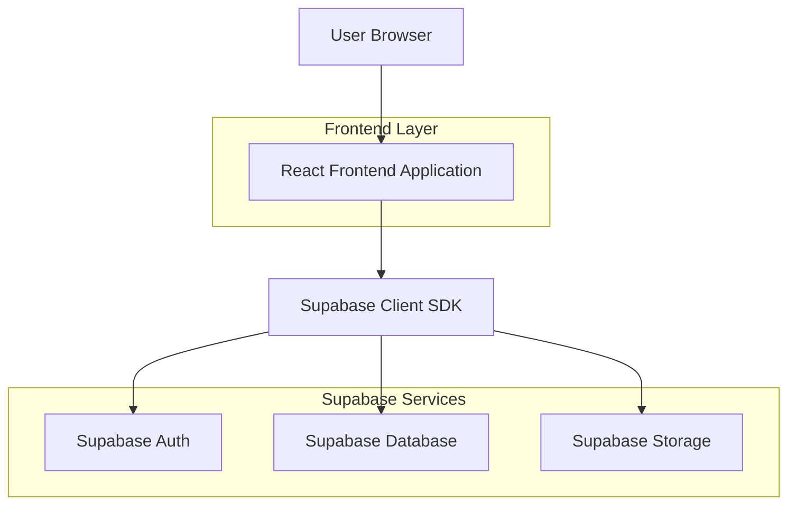
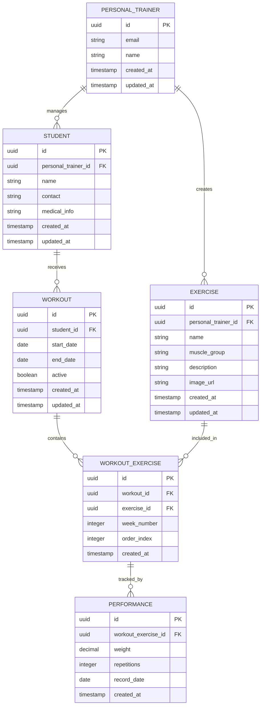

## 1. Arquitetura do Sistema



## 2. Stack Tecnológica

- **Frontend**: React@18 + TypeScript + TailwindCSS@3 + Vite
- **Ferramenta de Inicialização**: vite-init
- **Backend**: Supabase (BaaS - Backend as a Service)
- **Banco de Dados**: PostgreSQL (via Supabase)
- **Autenticação**: Supabase Auth
- **Storage**: Supabase Storage (para imagens de exercícios)
- **Gráficos**: Recharts (para visualizações de desempenho)
- **Drag & Drop**: @dnd-kit/core (para montagem de treinos)
- **Gerenciamento de Estado**: React Context API + useReducer
- **Validação de Formulários**: React Hook Form + Zod

## 3. Definições de Rotas

| Rota | Finalidade |
|------|------------|
| / | Dashboard principal com resumos e estatísticas |
| /login | Página de autenticação do personal trainer |
| /alunos | Lista e gerenciamento de alunos |
| /alunos/novo | Formulário de cadastro de novo aluno |
| /alunos/:id | Detalhes e edição de aluno específico |
| /exercicios | Banco de exercícios com grid e filtros |
| /exercicios/novo | Formulário de cadastro de exercício |
| /exercicios/:id | Edição de exercício existente |
| /treinos/novo | Interface de criação de treinos |
| /treinos/:id | Visualização e edição de treino específico |
| /acompanhamento | Registro semanal de desempenho |
| /acompanhamento/:alunoId | Acompanhamento específico por aluno |
| /configuracoes | Perfil e preferências do sistema |

## 4. Modelos de Dados

### 4.1 Diagrama ER



### 4.2 Definições de Tabelas (DDL)

#### Tabela de Personal Trainers
```sql
CREATE TABLE personal_trainers (
    id UUID PRIMARY KEY DEFAULT gen_random_uuid(),
    email VARCHAR(255) UNIQUE NOT NULL,
    name VARCHAR(255) NOT NULL,
    created_at TIMESTAMP WITH TIME ZONE DEFAULT NOW(),
    updated_at TIMESTAMP WITH TIME ZONE DEFAULT NOW()
);

-- Índice para busca rápida por email
CREATE INDEX idx_personal_trainers_email ON personal_trainers(email);
```

#### Tabela de Alunos
```sql
CREATE TABLE students (
    id UUID PRIMARY KEY DEFAULT gen_random_uuid(),
    personal_trainer_id UUID NOT NULL REFERENCES personal_trainers(id) ON DELETE CASCADE,
    name VARCHAR(255) NOT NULL,
    contact VARCHAR(255),
    medical_info TEXT,
    created_at TIMESTAMP WITH TIME ZONE DEFAULT NOW(),
    updated_at TIMESTAMP WITH TIME ZONE DEFAULT NOW()
);

-- Índices para performance
CREATE INDEX idx_students_personal_trainer_id ON students(personal_trainer_id);
CREATE INDEX idx_students_name ON students(name);
```

#### Tabela de Exercícios
```sql
CREATE TABLE exercises (
    id UUID PRIMARY KEY DEFAULT gen_random_uuid(),
    personal_trainer_id UUID NOT NULL REFERENCES personal_trainers(id) ON DELETE CASCADE,
    name VARCHAR(255) NOT NULL,
    muscle_group VARCHAR(100) NOT NULL,
    description TEXT,
    image_url VARCHAR(500),
    created_at TIMESTAMP WITH TIME ZONE DEFAULT NOW(),
    updated_at TIMESTAMP WITH TIME ZONE DEFAULT NOW()
);

-- Índices para filtros e buscas
CREATE INDEX idx_exercises_personal_trainer_id ON exercises(personal_trainer_id);
CREATE INDEX idx_exercises_muscle_group ON exercises(muscle_group);
CREATE INDEX idx_exercises_name ON exercises(name);
```

#### Tabela de Treinos
```sql
CREATE TABLE workouts (
    id UUID PRIMARY KEY DEFAULT gen_random_uuid(),
    student_id UUID NOT NULL REFERENCES students(id) ON DELETE CASCADE,
    start_date DATE NOT NULL,
    end_date DATE NOT NULL,
    active BOOLEAN DEFAULT true,
    created_at TIMESTAMP WITH TIME ZONE DEFAULT NOW(),
    updated_at TIMESTAMP WITH TIME ZONE DEFAULT NOW()
);

-- Índices para consultas frequentes
CREATE INDEX idx_workouts_student_id ON workouts(student_id);
CREATE INDEX idx_workouts_active ON workouts(active);
CREATE INDEX idx_workouts_dates ON workouts(start_date, end_date);
```

#### Tabela de Exercícios do Treino
```sql
CREATE TABLE workout_exercises (
    id UUID PRIMARY KEY DEFAULT gen_random_uuid(),
    workout_id UUID NOT NULL REFERENCES workouts(id) ON DELETE CASCADE,
    exercise_id UUID NOT NULL REFERENCES exercises(id) ON DELETE CASCADE,
    week_number INTEGER NOT NULL,
    order_index INTEGER NOT NULL,
    created_at TIMESTAMP WITH TIME ZONE DEFAULT NOW(),
    UNIQUE(workout_id, exercise_id, week_number)
);

-- Índices para ordenação e busca
CREATE INDEX idx_workout_exercises_workout_id ON workout_exercises(workout_id);
CREATE INDEX idx_workout_exercises_exercise_id ON workout_exercises(exercise_id);
CREATE INDEX idx_workout_exercises_week ON workout_exercises(workout_id, week_number, order_index);
```

#### Tabela de Desempenho
```sql
CREATE TABLE performances (
    id UUID PRIMARY KEY DEFAULT gen_random_uuid(),
    workout_exercise_id UUID NOT NULL REFERENCES workout_exercises(id) ON DELETE CASCADE,
    weight DECIMAL(5,2),
    repetitions INTEGER,
    record_date DATE NOT NULL,
    created_at TIMESTAMP WITH TIME ZONE DEFAULT NOW(),
    UNIQUE(workout_exercise_id, record_date)
);

-- Índices para consultas de evolução
CREATE INDEX idx_performances_workout_exercise_id ON performances(workout_exercise_id);
CREATE INDEX idx_performances_record_date ON performances(record_date);
CREATE INDEX idx_performances_date_range ON performances(workout_exercise_id, record_date);
```

### 4.3 Políticas de Segurança (RLS)

#### Políticas para Students
```sql
-- Permitir leitura apenas dos próprios alunos
CREATE POLICY "Personal trainers can view their own students" ON students
    FOR SELECT USING (auth.uid() = personal_trainer_id);

-- Permitir inserção de alunos vinculados ao personal
CREATE POLICY "Personal trainers can create their own students" ON students
    FOR INSERT WITH CHECK (auth.uid() = personal_trainer_id);

-- Permitir atualização apenas dos próprios alunos
CREATE POLICY "Personal trainers can update their own students" ON students
    FOR UPDATE USING (auth.uid() = personal_trainer_id);

-- Permitir exclusão apenas dos próprios alunos
CREATE POLICY "Personal trainers can delete their own students" ON students
    FOR DELETE USING (auth.uid() = personal_trainer_id);
```

#### Políticas para Exercises
```sql
-- Permitir leitura apenas dos próprios exercícios
CREATE POLICY "Personal trainers can view their own exercises" ON exercises
    FOR SELECT USING (auth.uid() = personal_trainer_id);

-- Permitir inserção de exercícios vinculados ao personal
CREATE POLICY "Personal trainers can create their own exercises" ON exercises
    FOR INSERT WITH CHECK (auth.uid() = personal_trainer_id);

-- Permitir atualização apenas dos próprios exercícios
CREATE POLICY "Personal trainers can update their own exercises" ON exercises
    FOR UPDATE USING (auth.uid() = personal_trainer_id);

-- Permitir exclusão apenas dos próprios exercícios
CREATE POLICY "Personal trainers can delete their own exercises" ON exercises
    FOR DELETE USING (auth.uid() = personal_trainer_id);
```

#### Políticas para Workouts e Performance
```sql
-- Políticas similares para workouts, workout_exercises e performances
-- Todas seguem o padrão de restringir ao personal trainer autenticado
```

## 5. Configuração do Supabase

### 5.1 Variáveis de Ambiente
```bash
VITE_SUPABASE_URL=https://sua-instancia.supabase.co
VITE_SUPABASE_ANON_KEY=sua-chave-anon
```

### 5.2 Configuração do Cliente
```typescript
import { createClient } from '@supabase/supabase-js'

const supabaseUrl = import.meta.env.VITE_SUPABASE_URL
const supabaseAnonKey = import.meta.env.VITE_SUPABASE_ANON_KEY

export const supabase = createClient(supabaseUrl, supabaseAnonKey)
```

### 5.3 Permissões de Acesso
```sql
-- Conceder permissões básicas para anon e authenticated
GRANT SELECT ON students TO anon;
GRANT ALL PRIVILEGES ON students TO authenticated;

GRANT SELECT ON exercises TO anon;
GRANT ALL PRIVILEGES ON exercises TO authenticated;

GRANT SELECT ON workouts TO anon;
GRANT ALL PRIVILEGES ON workouts TO authenticated;

GRANT SELECT ON workout_exercises TO anon;
GRANT ALL PRIVILEGES ON workout_exercises TO authenticated;

GRANT SELECT ON performances TO anon;
GRANT ALL PRIVILEGES ON performances TO authenticated;
```

## 6. Componentes React Principais

### 6.1 Estrutura de Pastas
```
src/
├── components/
│   ├── common/
│   │   ├── Button.tsx
│   │   ├── Input.tsx
│   │   ├── Modal.tsx
│   │   └── Table.tsx
│   ├── layout/
│   │   ├── Sidebar.tsx
│   │   ├── Header.tsx
│   │   └── Layout.tsx
│   ├── students/
│   │   ├── StudentForm.tsx
│   │   ├── StudentList.tsx
│   │   └── StudentDetails.tsx
│   ├── exercises/
│   │   ├── ExerciseForm.tsx
│   │   ├── ExerciseGrid.tsx
│   │   └── ExerciseCard.tsx
│   ├── workouts/
│   │   ├── WorkoutBuilder.tsx
│   │   ├── ExerciseSelector.tsx
│   │   └── WeekViewer.tsx
│   └── performance/
│       ├── PerformanceForm.tsx
│       ├── PerformanceChart.tsx
│       └── WeekComparison.tsx
├── hooks/
│   ├── useAuth.ts
│   ├── useStudents.ts
│   ├── useExercises.ts
│   ├── useWorkouts.ts
│   └── usePerformance.ts
├── contexts/
│   ├── AuthContext.tsx
│   └── ThemeContext.tsx
├── utils/
│   ├── validation.ts
│   ├── dateHelpers.ts
│   └── chartHelpers.ts
└── types/
    ├── student.ts
    ├── exercise.ts
    ├── workout.ts
    └── performance.ts
```

### 6.2 Tipos TypeScript Principais
```typescript
// types/student.ts
export interface Student {
  id: string
  personal_trainer_id: string
  name: string
  contact?: string
  medical_info?: string
  created_at: string
  updated_at: string
}

// types/exercise.ts
export interface Exercise {
  id: string
  personal_trainer_id: string
  name: string
  muscle_group: string
  description?: string
  image_url?: string
  created_at: string
  updated_at: string
}

// types/workout.ts
export interface Workout {
  id: string
  student_id: string
  start_date: string
  end_date: string
  active: boolean
  created_at: string
  updated_at: string
}

export interface WorkoutExercise {
  id: string
  workout_id: string
  exercise_id: string
  week_number: number
  order_index: number
  created_at: string
  exercise?: Exercise
}

// types/performance.ts
export interface Performance {
  id: string
  workout_exercise_id: string
  weight?: number
  repetitions?: number
  record_date: string
  created_at: string
}
```

## 7. Considerações de Performance

### 7.1 Otimizações de Consulta
- Implementar paginação para listagens grandes (students, exercises)
- Usar índices apropriados em colunas frequentemente consultadas
- Implementar cache local para dados que não mudam frequentemente
- Usar React Query ou SWR para cache de requisições

### 7.2 Lazy Loading
- Carregar componentes de forma lazy usando React.lazy()
- Implementar infinite scroll para listagens extensas
- Carregar imagens de exercícios sob demanda

### 7.3 Bundle Optimization
- Code splitting por rotas
- Tree shaking para remover código não utilizado
- Comprimir imagens antes do upload para o Supabase Storage

## 8. Testes e Qualidade

### 8.1 Testes Unitários
- Testar funções de validação de formulários
- Testar helpers de data e cálculos de semanas
- Testar formatação de dados para exibição

### 8.2 Testes de Integração
- Testar fluxo completo de criação de treino
- Testar cálculo de evolução de performance
- Testar permissões e segurança (RLS)

### 8.3 Testes de UI
- Testar responsividade em diferentes tamanhos de tela
- Testar acessibilidade com leitores de tela
- Testar performance com grande volume de dados